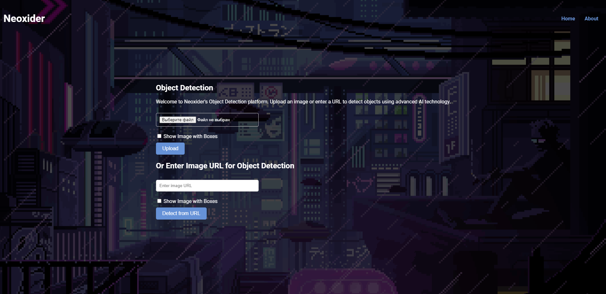
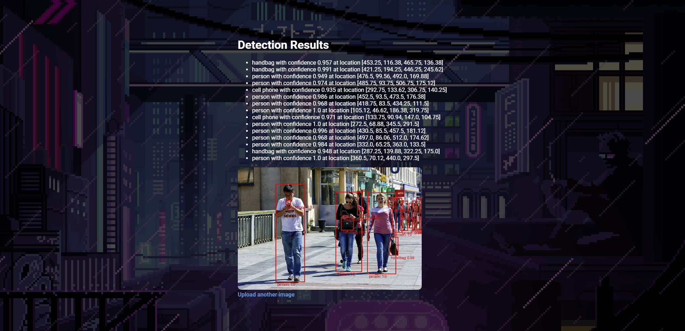

# Object Detector Image




## Описание проекта

**Object Detector Image** — это веб-приложение, реализованное на Flask, которое позволяет загружать изображения и детектировать объекты на них с использованием предобученной модели `DETR` (Detection Transformer) на основе ResNet50. Приложение поддерживает загрузку изображений как через форму на веб-странице, так и по URL.

## Функциональность

1. **Загрузка изображения:** Пользователь может выбрать изображение с локального диска и отправить его на обработку.
2. **Детектирование объектов:** Используется модель `DETR`, обученная для распознавания различных классов объектов.
3. **Отображение результатов:** После анализа изображения пользователь получает отчет о найденных объектах, включая метки и координаты боксов с обнаруженными объектами.
4. **Визуализация:** При необходимости можно получить изображение с наложенными боксами вокруг распознанных объектов.

## Установка и запуск

### Требования

- Python 3.8 или выше
- Flask
- Torchvision (для моделей обнаружения)
- PIL (для работы с изображениями)

### Шаги по установке

1. **Клонирование репозитория:**
   ```bash
   git clone https://github.com/your-repo/Object-Detector-Image.git
   cd Object-Detector-Image